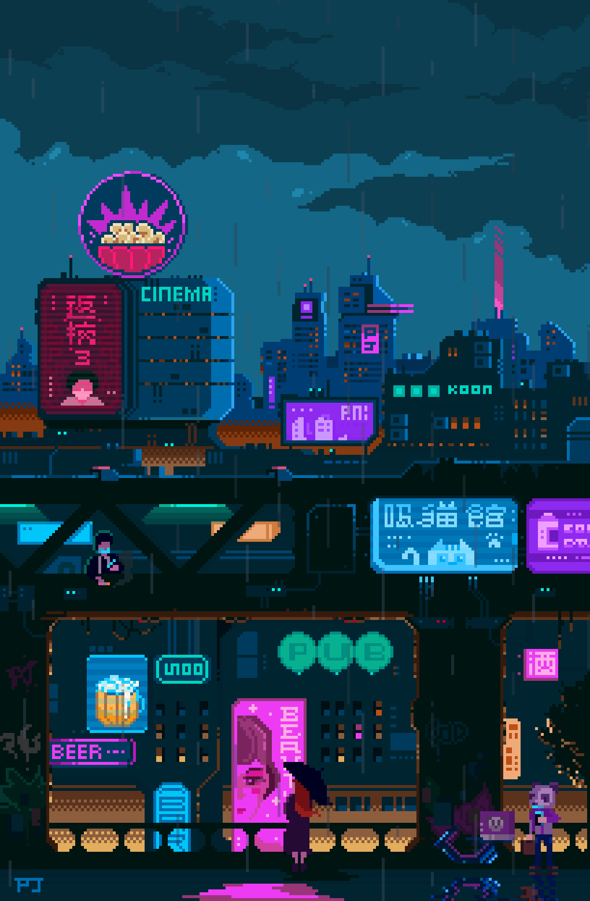

<table width="100%" cellpadding="0" cellspacing="0">
  <tr>
    <td align="center" valign="middle" width="14%"></td>
    <td align="center" valign="middle" width="72%">
      <h1 align="center">Hi, I'm Shahriar Oishik</h1>
      
<strong>Full-Stack Developer | Exploring RAG Systems</strong> Computer Science student at East West University | Dhaka, Bangladesh

      
<a href="mailto:oishik278@gmail.com"><strong>Email</strong></a> · <a href="https://github.com/ShahriarOishik"><strong>GitHub</strong></a> · <a href="https://www.linkedin.com/in/shahriar-oishik"><strong>LinkedIn</strong></a>

    </td>
    <td align="center" valign="middle" width="14%"></td>
  </tr>
</table>

## About Me
<table width="100%" cellpadding="0" cellspacing="8">
  <tr>
    <td valign="top" width="60%">
      <h3>Building with purpose</h3>
      
I am a Computer Science student at East West University and an Undergraduate Teaching Assistant. I learn by building practical software, sharing what I learn, and turning difficult problems into cleaner systems.

      
<strong>Interests:</strong> modern web development, retrieval-augmented generation, vector search, and algorithmic problem-solving.

    </td>
    <td valign="top" width="40%">
      <table width="100%" border="1" cellpadding="8" cellspacing="0">
        <tr><td>
          
<strong>Academic Snapshot</strong>

          
<strong>Program</strong> Bachelor's in Computer Science (CSE)

          
<strong>Current CGPA</strong> 3.92 / 4.00

          
<strong>Credits Completed</strong> 117 / 140

          
<strong>Recognition</strong> Merit Scholarship Dean's List for 3 consecutive years

        </td></tr>
      </table>
    </td>
  </tr>
</table>

## Focus & Direction
<table width="100%" cellpadding="6" cellspacing="0">
  <tr>
    <td valign="top" width="50%">
      <strong>Current focus</strong>
      <ul>
        <li>Building and experimenting with retrieval-augmented generation systems.</li>
        <li>Deepening practical knowledge of embeddings, vector search, and applied AI.</li>
        <li>Strengthening full-stack engineering and algorithmic problem-solving.</li>
      </ul>
    </td>
    <td valign="top" width="50%">
      <strong>Focus areas</strong> 
      
      
      
    </td>
  </tr>
</table>

## Technical Stack
<table width="100%" cellpadding="6" cellspacing="0">
  <tr>
    <td valign="top" width="18%"><strong>Languages</strong></td>
    <td></td>
  </tr>
  <tr>
    <td valign="top"><strong>Frontend</strong></td>
    <td></td>
  </tr>
  <tr>
    <td valign="top"><strong>Backend</strong></td>
    <td>  </td>
  </tr>
  <tr>
    <td valign="top"><strong>AI / Data</strong></td>
    <td>    </td>
  </tr>
  <tr>
    <td valign="top"><strong>Tools</strong></td>
    <td>   </td>
  </tr>
</table>

## Selected Work
<table width="100%" cellpadding="6" cellspacing="0">
  <tr>
    <td valign="top" width="50%">
       
      
      
    </td>
    <td valign="top" width="50%">
       
      
      
    </td>
  </tr>
</table>

<a href="https://github.com/ShahriarOishik?tab=repositories"><strong>View all repositories</strong></a>

## Competitive Programming

Live statistics from my public Codeforces, CodeChef, LeetCode, and Kaggle profiles.

<table width="100%" cellpadding="6" cellspacing="0">
  <tr>
    <td width="50%" valign="top"></td>
    <td width="50%" valign="top"></td>
  </tr>
  <tr>
    <td valign="top"></td>
    <td valign="top">
      <table width="100%" border="1" cellpadding="8" cellspacing="0">
        <tr><td align="center"> Data science, competitions, notebooks, and datasets <a href="https://www.kaggle.com/souldiamond">View Kaggle profile</a></td></tr>
      </table>
    </td>
  </tr>
</table>

## GitHub Activity
<table width="100%" cellpadding="6" cellspacing="0">
  <tr>
    <td width="50%"></td>
    <td width="50%"></td>
  </tr>
</table>

## Connect

   

