  

<h1 align="center">Hi, I'm Shahriar Oishik</h1>

<strong>Full-Stack Developer | Exploring RAG Systems</strong>

Computer Science student at East West University | Dhaka, Bangladesh

  
  
  

## About Me

I am currently a Computer Science student at East West University, where I also work as an Undergraduate Teaching Assistant. I enjoy learning by building practical software, sharing knowledge, and strengthening my skills in modern web development and retrieval-augmented generation.

## Education

  

## Current Focus

- Learning and experimenting with retrieval-augmented generation systems.
- Improving my understanding of embeddings, vector search, and applied machine learning.
- Strengthening my full-stack development and algorithmic problem-solving skills.

## Focus Areas

  
  
  

## Skills & Technical Stack

### Programming Languages

  

### Frontend Development

  

### Backend & APIs

  

  
  

### Data, AI & RAG

  
  
  
  
  

### Tools & Platforms

  

  
  
  

## Selected Work

  

  
  

  

  
  

<a href="https://github.com/ShahriarOishik?tab=repositories"><strong>View all repositories</strong></a>

## Professional Links

  
  
  

## Competitive Experience

Live competitive programming and problem-solving statistics from my public profiles.

  

  

  

<table align="center">
  <tr>
    <td align="center" width="50%">
      
        
      <strong>Data Science & Competitions</strong>
       
      Competitions, notebooks, and datasets
        
      <a href="https://www.kaggle.com/souldiamond">View Kaggle profile</a>
    </td>
  </tr>
</table>

## Other Social Links

  
  
  

## GitHub Activity

  

  

  

  

